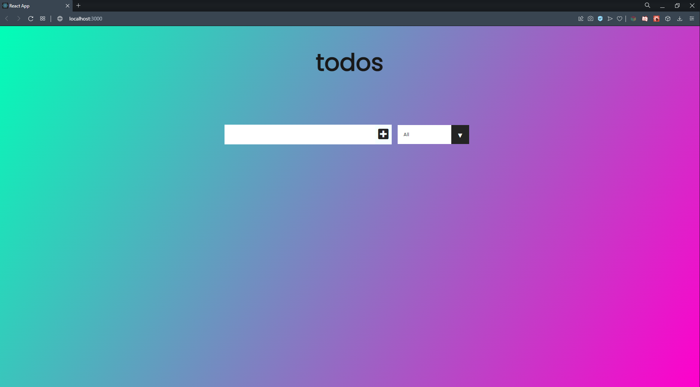
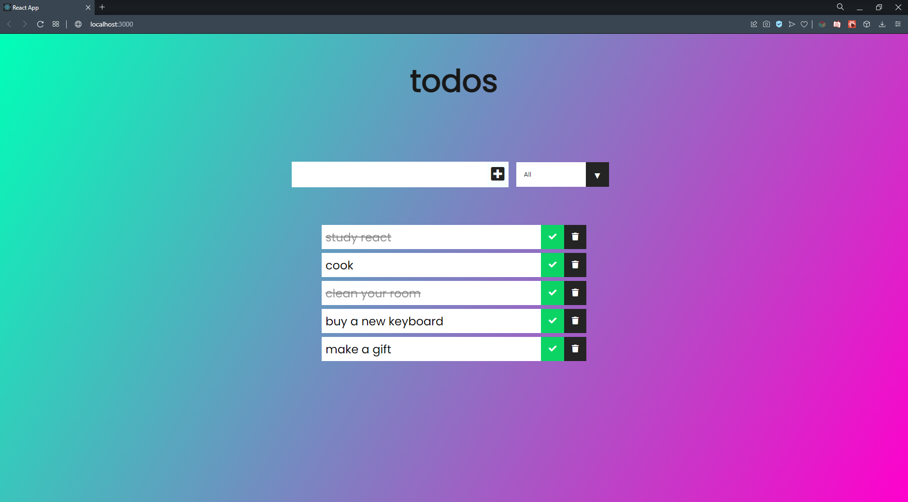
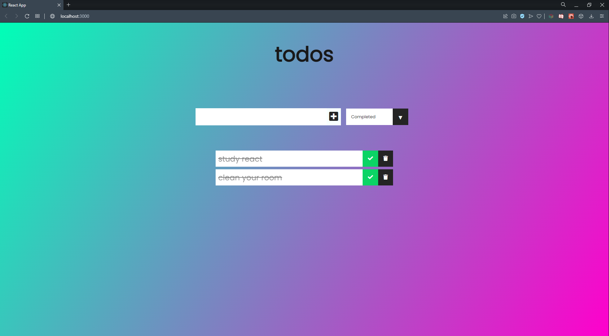

# React Todo App.

This project is the 2nd assignment "Todo App" application in React.js lessons of "Frontend Web Development Patikası" on the [patika.dev](https://app.patika.dev/) platform.

## Project Images

### Project Image - 1


### Project Image - 2


### Project Image - 3


## Technologies Used

* HTML
* CSS
* JavaScript
* Node Js
* React

## Setup/Installation

Clone the project

```bash
  git clone https://github.com/dyakupoglu/React-Todo-App.git
```

Install neccessary files

```bash
  npm install
```

Run the server

```bash
  npm run start
```

## License

Licensed under the [MIT License](https://github.com/dyakupoglu/React-Todo-App/blob/main/LICENSE)